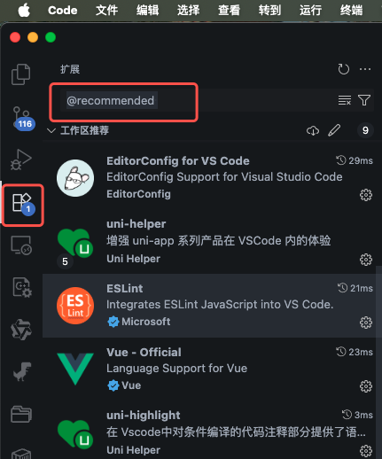
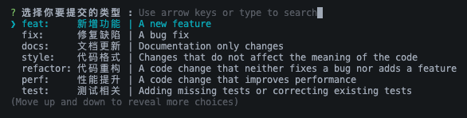

# 开发前准备

## 运行环境

- node 版本要求：>= 18.12，推荐使用 20（lts），或使用最新版（lts）
- pnpm 版本要求：>= 8

  ```bash
  # pnpm 安装方式
  npm install -g pnpm@latest-10
  ```

  :::tip
  推荐使用 nvm 管理 node 版本

  ```
  nvm install 20 # 安装 node 20 长期支持版本
  nvm use 20 # 切换到 node 20
  ```

  :::

## 开发工具及项目拉取、代码提交

### vscode 插件安装

使用 vscode 打开项目后，会在右下角弹窗提示安装推荐插件，安装即可；

若没有弹窗提示，点击左侧插件按钮，搜索 @recommended，安装全部插件。



### 项目拉取

项目地址：[uniapp-template](https://gitlab.hivery.cn/template/uniapp-template)，建议 fork 项目，然后 clone 项目到本地。

1. `master` 分支为示例项目，包含所有示例；
2. `clean` 分支为项目模板，只包含基础项目功能，不包含示例页面，建议在此基础上进行二次开发。

### 代码提交

项目在提交代码时会进行本地代码检测，包括代码格式、代码规范等，使用 `pnpm cz` 命令提交到本地。



## 项目启动、打包、发布

### 项目启动

```bash
# 安装依赖
pnpm i

# 启动 H5 端
pnpm dev:h5

# 启动微信小程序端
pnpm dev:mp-weixin

# 启动 app 端
pnpm dev:app
```

#### 升级 uniapp 依赖

```bash
# 升级 uniapp 依赖
pnpm uvm

# 清理无用依赖，减少构建体积
pnpm uvm-cleanup
```

### 项目打包

```bash
# 构建开发环境
pnpm build:h5 # h5 端
pnpm build:mp-weixin # 微信小程序端
pnpm build:app # app 端

# 构建测试环境
pnpm build:h5-test # h5 端
pnpm build:mp-weixin-test # 微信小程序端
pnpm build:app-test # app 端

# 构建生产环境
pnpm build:h5-prod # h5 端
pnpm build:mp-weixin-prod # 微信小程序端
pnpm build:app-prod # app 端

```

:::warning
除 `h5` 端外，其它端启动、发行需借助各端对应的工具，比如：

- 微信小程序：借助微信开发者工具运行、调试、发布
- app：借助 HBuilderX 发行，调试可运行 h5 端在浏览器调试
  :::
